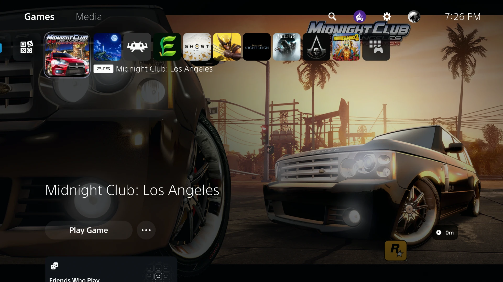

# MCLA

Static recompilation of *Midnight Club: Los Angeles Complete Edition* (Xbox 360, title 545407F8) to native code, for PC and for jailbroken PS5 consoles.



*Installed on a jailbroken PS5. The tile here is one the user supplied at build time; the background is made from the art on their own disc.*

**This repository contains no game code, assets or keys.** You supply your own legally obtained copy; a script extracts what is needed on your machine, and the recompiled code is generated locally and never committed.

## Status

| Target | State |
|---|---|
| Windows, D3D12 | Boots; menus, races, garage and upgrades work with audio and controller. 30 FPS with occasional texture-load hitches. |
| Windows, Vulkan | Reaches the title screen. Not tested further. |
| Linux | Not built yet. |
| PS5 (jailbroken) | Plays: career, races, garage, saves, audio and controller, at a steady 30 FPS on a PS5 Pro (firmware 13.42), where the zoomed-out map runs at 20 to 25. Also tested on a PS5 Slim (firmware 12.70), installed from scratch with the one-command build, where it runs well; frame rates were measured on the Pro only. Build and install with one command: `docs/ps5-build-guide.md`. |

Details and open problems: `docs/known-issues.md`.

## Which release of the game

Everything here was made with, and is only known to work with, **Midnight Club: Los Angeles Complete Edition, USA/Europe, for Xbox 360** (title id `545407F8`). The hooks and function hints in `config/` are addresses in that release's executable; another region or revision would need them checked again.

## How it works

The game's PowerPC code is translated to C++ ahead of time by the [ReXGlue SDK](https://github.com/rexglue/rexglue-sdk) (BSD-3, derived from Xenia), which also provides the Xbox 360 kernel, GPU and audio reimplementation. This repository holds the project manifest, function-recovery hints, a small host application, SDK patches, scripts and notes. See `docs/architecture.md`.

## Building and running (Windows)

```powershell
.\scripts\make_pc.ps1 -Iso C:\path\to\your.iso
.\scripts\play_loop.ps1
```

The first command clones and patches the ReXGlue SDK, builds it, extracts your game, recompiles its code and builds `mcla.exe`; the second starts the game. Requirements (Git, CMake, Ninja, Clang 20, Visual Studio Build Tools, Python 3), every step by hand, options and troubleshooting are in [`docs/pc-build-guide.md`](docs/pc-build-guide.md).

## Building and installing (PS5)

```bash
bash ps5/make_ps5.sh --iso /path/to/your.iso --console <console address>
```

on Arch Linux as root (a few commands to set up under WSL2 on Windows). It builds the toolchain, the Vulkan driver, the recompiler and the game from your own disc image, and uploads the result to the console. The whole procedure, requirements and troubleshooting are in [`docs/ps5-build-guide.md`](docs/ps5-build-guide.md), written so that it can also be handed to an AI coding agent.

## Layout

| Path | Contents |
|---|---|
| `config/` | Function-entry hints, each file documenting how its entries were found |
| `src/` | Host application: audio fallback, crash tracer, function-pointer scan |
| `patches/` | Changes to the ReXGlue SDK |
| `scripts/` | Extraction, build, run and analysis scripts |
| `ps5/` | The PS5 host, the one-command build (`make_ps5.sh`), title packaging and console probes |
| `docs/` | Build guides for PC and PS5, recon report, architecture, function recovery, known issues, PS5 port notes |

## Credits

- ReXGlue SDK by Tom Clay and contributors; Xenia by Ben Vanik and contributors.
- [LARecomp](https://github.com/mzzvxm/LARecomp) by mzzvxm and contributors. The `t:` drive mapping and the diagnosis of the SDK vblank timer problem come from that project's notes.
- [PS5_Vulkan](https://github.com/mihawk-99/PS5_Vulkan) by mihawk-99 (GPL-3): the RADV port and toolchain the PS5 version is built on.
- XenonRecomp by hedge-dev, on which ReXGlue's analysis builds.

## Licence

GPL-3.0-or-later; see `LICENSE`. *Midnight Club* is a trademark of Take-Two Interactive. This project is not affiliated with or endorsed by Rockstar Games or Take-Two.
